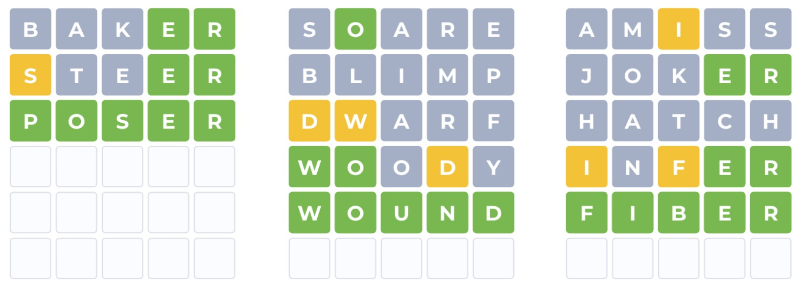
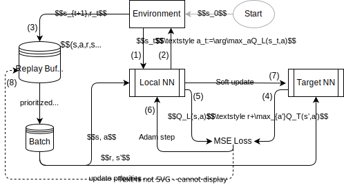
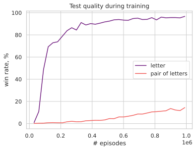
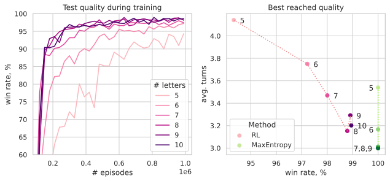
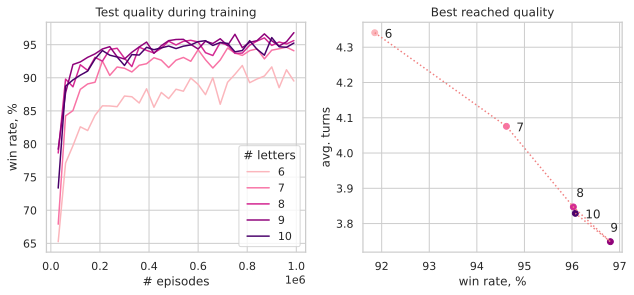

# Deep Q Networks for playing Wordle

This repo contains implementation of DQN algorithm in vanila version of Mnih et al., 2013, for playing Wordle. The main result is trained RL agent, that is close to MaxEntropy algorithm on two metrics: average turns and win rate on 2315 words. The description of a Q-learning, the built framework and the training procedure is given. The generalizing ability of the final solution is estimated using various complications of the original game. Possible solutions that have not been implemented are mentioned in the end.

Requirements:
- `annoy==1.17.2`
- `numpy==1.23.5`
- `pandas==2.0.1`
- `scipy==1.10.1`
- `torch==2.0.0`
- `tqdm==4.65.0`

## Setting

### Wordle

In the original Wordle game, which went viral in January 2022, you have to guess a five-letter word. The player has six attempts to enter a word. In the entered word, each letter is colored green, yellow or gray. Green color means that both the letter and its position in the target word are guessed. Yellow color means the letter is guessed, but not the position. Gray color means this letter is not in the target word. For words with repeated letters, the described coloring rules are slightly violated. The game ends if the word is guessed or six attempts are exhausted.



In order for meaningful words to participate in the game, the player is allowed to enter only words from a specified list (in the original game it contained 12972 five-letter words), we will call it large list. At the same time, not all of them can participate as a target, but only those that are duplicated in a separate list (in the original game it contained 2315 five-letter words), we will call it small list.

### Q-Learning and DQN

Let Q-function be a mapping from state-action pair to expected return till the end of an episode:

$$
q_\pi(s,a)=\mathbb{E}_\pi[R_t+R_{t+1}+\ldots+R_T\,|\,S_t=s,A_t=a].
$$

The Q-learning procedure aims to estimate Q-function.

- Collect experience. Collect set of tuples $S_t, A^\pi_t, R_t,S_{t+1}$ from sampling episodes with agent following policy $\pi$ with $\varepsilon$-chance of exploring action.
- Function approximation. If the sets $\mathcal{S},\mathcal{A}$ are finite, then we can perceive Q-function as some tabular data and simply fill in its fields according to the accumulated experience.

$$
Q_{k+1}(S_t,A_t):= (1-\alpha)Q_k(S_t,A_t)+\alpha[R_{t+1}+\gamma\max_{a'} Q_k(S_{t+1},a')].
$$

- Update policy. Freeze new policy: $\pi'(s):=\arg\max_a Q_\pi(s,a),\ \forall s\in\mathcal{S}$.

When sets $\mathcal{S},\mathcal{A}$ are too large, we may not be able to implement a Q-table. This cases deep neural networks can be used as the mapping state observation $s$ to values $Q(s,a)$ for each $a\in\mathcal{A}$. If we add a few more improvements to this algorithm, we get an algorithm called Deep Q Networks (Mnih et al., 2013).



## Solution details and training tricks

**Reward.** For each attempt, the agent receives the following reward: $+1$ for each green and yellow letter, $-5$ for nothing, $+15$ in case of winning, $-15$ in case of loss, $-0.1$ for re-entering green letters.

**Environment observation.** The state of the system is encoded using crafted features, namely a vector of 313 numbers: 1) the number of attempts remaining, 2) indicators "this letter was previously entered by the player", 3) indicators "this letter was colored green or yellow" (indicator of presence in the word), 4) indicators "this letter is exactly at the given position in the word", 5) indicators "this letter is definitely not at the given position in the word". These features imitate the information that a person uses when playing Wordle.

**Reduce action space dimentionality.** The list of agent actions in the simplest version coincides with the list of words that can be entered (large list). Such a solution is universal, since it does not restrict the model in any way, but training a network with such a large number of outputs turns out to be difficult. Therefore, to reduce the number of network outputs, the following simplification is proposed: we replace the action "select a word" with several independent actions "select a letter for a given position", we assume that the value of a word is equal to the sum of the values of its letters. This idea can be implemented as follows: 1) encode each word with a vector of 130 values (replace each of the five letters of the word with a One-Hot vector of 26 components), the codes of all words form a One-Hot matrix, 2) at the output of the Q-network, issue a vector of 130 numbers and multiply it by the One-Hot matrix of the encodings of all the words in the dictionary.

**Prioritized replay buffer.** Each entry in the buffer is assigned a priority $p_i$. The first time an entry enters the buffer, it is assigned a priority equal to the maximum among all available. Further, if the entry $(s,a,r,s')$ was used to train the local network, then it is assigned a new priority and the sampling probability $P_i$ are assigned as follows:

$$
p_i:=\left|Q_L(s,a)-[r+\max_{a'}Q_T(s',a')]\right|+\varepsilon,\quad P_i:={p_i^\alpha\over\sum_jp_j^\alpha},
$$

where $\varepsilon$ is a small constant to avoid zero priority, $\alpha$ is used to control how much the priorities will distort sampling: with $\alpha=0$ sampling is uniform, with $\alpha\gg0$ it is highly prioritized.

**Playing games in parallel way.** Note that in figure with DQN steps $(1)$ and $(2)$ use the neural network pass inefficiently: only one $s_t$ vector is given as input, while neural networks are able to efficiently process data batches. A significant acceleration of learning is the simulation of not one game, but a batch of games at once. In the final solution, the following scheme was used: a list of eight environments is initialized, at each step, state vectors are collected from all incomplete environments, and this batch is fed to the agent. After that, the Q-nets are updated. The next batch is initialized when all games from the current batch are finished.

**Solve subproblems first.** It is sometimes difficult to immediately train an agent on a complete task of 12972 words. In the Wordle task, you can train the agent on tasks growing in the number of words, eventually reaching the full list. Such staging was used only during development, the final solution is able to learn on the full list.

**Prioritized game sampling.** Instead of the described sampling of batches for learning, you can sample the games themselves to adjust the frequency of guessing individual words. For example, you can assign probabilities proportional to the number of times the agent lost and did not guess the given word. This trick was used for the final quality improvement, together with fine tuning and a decreasing optimzier's learning rate.

## Results

### Metrics and Strategy Analysis

The table below presents the results of training the RL agent in comparison with the MaxEntropy algorithm and the exact solution. My solution is inferior to the entropy one in quality, but not much compared to the exact one.

|            | DQN       | MaxEntrpy | Brute     |
| ---------- | --------- | --------- | --------- |
| Avg. Turns | 3.6959    | 3.6367    | 3.42      |
| Win Rate   | 2314/2315 | 2315/2315 | 2315/2315 |

The key difference between the agent's strategy and the MaxEntropy algorithm is that the agent simply selects letters, and the algorithm seeks to maximize the information gain. This is clearly seen in the example (on the left is the agent, on the right is MaxEntropy):

```
  S      O      C      L    **E** |   S      O      A      R    **E** 
  T      R      I      A     *D*  |  *G*   **U**    I      L      T   
  B    **U**  **D**  **G**  **E** |   B      A     *N*     J      O   
  J    **U**  **D**  **G**  **E** | **N**  **U**  **D**  **G**  **E** 
  F    **U**  **D**  **G**  **E** | 
**N**  **U**  **D**  **G**  **E** | 
```

With rare exceptions, the agent is able to win much faster than the MaxEntropy algorithm:

```
**S**    O     *C*    *L*   **E** | **S**    O      A      R    **E** 
**S**  **L**  **I**  **C**  **E** |   P    **L**  **I**    N      G   
                                  |   A     *C*     R     *I*     D   
                                  | **S**  **L**  **I**  **C**  **E** 
```

This fact is also reflected in the table below (see number of games with two turns).

|            | 2 turns | 3 turns | 4 turns | 5 turns | 6 turns |
| ---------- | ------- | ------- | ------- | ------- | ------- |
| DQN        | 53      | 872     | 1138    | 230     | 21      |
| MaxEntropy | 22      | 900     | 1292    | 99      | 2       |

Experiments show that the opening word (which is the same for any game, since the environment is initialized with the same state) is different for agents trained with the same parameters and on the same data. This is another confirmation that the agent's strategy is far from optimal. These shortcomings can be explained by the fact that the game model in my solution is much simplified, the agent evaluates the letters independently. An easy way to fix this a bit would be to consider not individual letters, but pairs of letters. However, such a model loses a lot in terms of training time. In figure below the comparison of two models: encoding of a word by letters and by pairs of letters. In the first case, the Q-network has 130 outputs, in the second, 1155 outputs.



### More Letters

For testing on tasks with lists of other words, the same training scheme was applied as for the main task. The only difference is the absence of "beating" the final quality, instead the agent is trained on a fixed number of episodes. On fig belw we see that as the number of letters in a word increases, both the learning rate and the best achieved quality increase. The latter is also true for the MaxEntropy algorithm. 



### More Words

For larger lists of words the picture is similar, except that the quality for each task is slightly worse.



### Generalizing Ability

If we train on those words that are included in the large list and are not included in the small one, then we will get a quality comparable to previous experiments. This example shows the generalizing ability of the solution in the sense that the agent is able to guess not only the words that were guessed during training.


However, if completely new words are added to the large and small lists, then the agent acts poorly. Experiments show that to overcome this, it is necessary to increase the number of letters in a word and make lists larger.

## Possible Improvements

**Environment observation.** According to the DQN architecture, the input of the Q-network is a vector encoding the state of the environment. In the described solution, this vector contains crafted features. In the general case, this method limits the architecture; moreover, the more complex the environment is, the more difficult it is for a person to come up with features. This representation problem can be solved using the encoder: convolutional network for images (Mnih et al., 2013), VAE for images (Watter et al., 2015), transformer for observations of complex structure (Santoro et  al., 2018, Vinyals et al., 2019). For the Wordle task, one could use an encoder that treats all previously received colorings as a sequence.

**Reducing action space dimentionality.** The problem of the large dimension of the action space was described above (in a naive implementation, it is equal to the number of words in the list). It was solved by simplifying the model: instead of evaluating the Q-function for the whole word, the agent does this for each letter independently. One of the alternative paths is described by Amos et al., 2017. It is proposed to construct a Q-net that implements a mapping $Q(s,a)$ that is convex with respect to the input $a$. This case, you can find an action that is optimal with respect to the agent's current strategy by solving the convex optimization problem: $a^*=\arg\max_a Q(s,a)$. For the Wordle task, you could use word embedding as the $a$ argument.

**Augmentation** was not used in my solution. For the Wordle task, a simple idea comes to mind: rearrange letters in words, change letters to different ones, concatenate pieces of different words. Such examples are not valid from the point of view of the game, because words should be meaningful, but hypothetically they could improve generalization ability. Augmentation plays significant role in AlphaGo (Silver et.al, 2016).

**Hyperparameters tuning.** The final solution contains a large number of hyperparameters (probability of an exploratory action $\varepsilon$, degree of prioritization $\alpha$, Q-nets update frequency, replay buffer size, reward system, number of Q-nets parameters, and so on). Each of them significantly affects the final quality, so tuning at least some of them can lead to more optimal strategies.